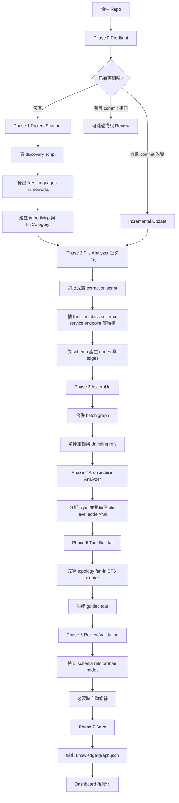

# Understand-Anything 中文版流程圖講稿

這份是「可以直接拿去講」的版本。

---

## 一句話開場

`Understand-Anything` 不是讓 AI 一次把整個 repo 看懂，而是把「理解陌生 repo」拆成一條多階段 agent pipeline，最後輸出成 knowledge graph。

---

## 可以直接講的流程圖

---

## 你可以直接這樣講

### 第一段：它不是一次讀完整個 repo

你可以這樣講：

> 這個專案不是把整個 repository 一次丟給模型，然後期待模型自動理解。它先做 pre-flight，看目前有沒有舊圖、有沒有變更，再決定要 full rebuild、incremental update，還是只做 review。

### 第二段：第一個 agent 先做 deterministic 掃描

你可以這樣講：

> 接著第一個 agent 叫 `project-scanner`。它不是先做語意分析，而是先寫腳本掃出整個專案有哪些檔案、各自屬於什麼 file category、用了哪些語言和框架，還會把專案內部 import 關係先解出來，形成 `importMap`。這一步的目標是把陌生 repo 先變成結構化 inventory。

### 第三段：第二個 agent 才開始把檔案變成圖

你可以這樣講：

> 第二個 agent 是 `file-analyzer`。它會把檔案分成多個 batch 平行處理。每個 batch 先寫腳本抽出結構，例如 function、class、schema、service、endpoint，再根據這些結果產生 graph 的 nodes 和 edges。這一步才是真正把 repo 從檔案集合變成知識圖。

### 第四段：它不是只看 code，也看非程式碼資產

你可以這樣講：

> 這套流程的特別之處，是它不只把 code 變成圖，也把 README、設定檔、Dockerfile、CI/CD、SQL、GraphQL、Terraform 這些 non-code 檔案一起放進圖裡。所以它不是只有 call graph，而是整個系統層級的 knowledge graph。

### 第五段：它還會做 architecture 分層

你可以這樣講：

> 圖建好之後，還會再交給 `architecture-analyzer`。這個 agent 會根據 import graph、檔案路徑、node type 和其他 edge，決定哪些檔案屬於 API layer、service layer、data layer、infrastructure layer、documentation layer 等等。也就是說，它不只告訴你誰依賴誰，還幫你整理成架構層次。

### 第六段：它還會做 onboarding 導覽

你可以這樣講：

> 再來是 `tour-builder`。它不只是隨便挑幾個檔案，而是先分析 graph topology，像是 fan-in、fan-out、entry points、BFS traversal、cluster，然後再排出一條 guided tour。這樣新進工程師不是只看到一張圖，而是知道應該先看哪裡、再看哪裡。

### 第七段：最後不是直接輸出，而是先 review

你可以這樣講：

> 最後還有 validation 和 review。系統會檢查 graph 裡有沒有 dangling edge、layer 和 tour 的 node 是否存在、每個 file-level node 是否都被分層。必要時還會自動修補，最後才寫出 `knowledge-graph.json`。dashboard 只是把這份 JSON 視覺化，不是理解流程本身。

---

## 如果你要講得更技術一點

可以加這段：

> 這個專案真正厲害的不是某個單一 AST parser，而是 orchestration。它把 repo understanding 拆成 scanner、analyzer、architecture、tour、review 幾個 agent，各自處理 deterministic 掃描、語意補強、分層、導覽和驗證，所以整體比直接問模型「這個 repo 在幹嘛」穩定很多。

---

## 如果你要講得更白話一點

也可以講成：

> 它的想法其實很像先畫地圖、再標建築、再分區、再做導覽手冊。最後你看到的是一張互動式地圖，但背後其實是一整條多步驟 pipeline。

---

## 一頁版收尾

最短收尾說法：

> `Understand-Anything` 把陌生 repo 的理解流程拆成掃描、抽結構、組圖、分層、導覽、驗證六大步，最後輸出成 knowledge graph。它不是靠單次提示把 repo 看懂，而是靠多 agent、可重跑、可增量更新的流程把 repo 逐層壓縮成一張可讀的圖。
